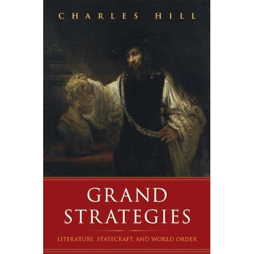

# Grand Strategies
## Charles Hill

***Page 4/5***

>... the modern international state system, launched in 1648 with the Treaty of Westphalia, which ended the religion-inflamed Thirty Years' War and which by the mid-twentieth century had become the recognized system through which states on every continent had agreed to conduct their official interactions.
>
>....
>
>The genius of the 1648 Westphalian system - the basis for today's international order, such as it is - was its one big "hedgehog" idea: that there must be many "foxes," organized through agreed procedures, to accommodate human diversity.

***Page 7***

>To put it as Paul Nitze would, in a "logic-chain," it is that 1) statecraft is protean, incessantly assuming different forms and presenting new predicaments beyond the ken of established methodologies; 2) some of the greatest classical texts - the <em>Iliad</em>, the<em>Aeneid</em> - deal with such challenges through their unboundedness, intertwining what would later be labeled as history, theology, psychology, literature, and philosophy before those modern disciplines were formalized; 3) literature, however, largely has remained unbounded, able to probe realms of statecraft which other disciplines have placed off-limits; and 4) some major works conventionally cataloged as nonfiction have jumped over methodological walls to become "fellow-travelers" of literature.

***Page 16***

>The line that is crossed, from precivilization to civilization, has at least six concepts of continuing importance.  The first is the shift from the family as the seat of governance to the <em>state</em>. Private interests, however, essential to human flourishing and societal productivity, may not over-top the <em>public</em> good. Status, largely related to family or clan, would in progressive societies shift "from status to <em>contract.</em>" Personal and family honor, when calling for "taking the law into your own hands," gives way to <em>justice</em>, administered publicly.  To administer justice properly, the integrity of the <em>process</em> must be maintained; regardless of the substance of the case, an ill-prepared court case must be dismissed even though the wrongdoer goes unpunished.  Finally, there is <em>marriage</em> as an institution of civilization: "Therefore shall a man leave his father and his mother, and shall cleave unto his wife: and they shall be one flesh." Status or kin relationship is superseded by contract: the marriage vows.

***Page 28***

>Socrates, in Plato's <em>Republic</em>, intellectually attempts to design a new polis.  The result is repulsive, perhaps an ironic demonstration of how pure intellect in its search for political utopia can produce a tyranny that would drain humanity of its capacity for virtue.  Xenophon takes another route, literally the road of an actually army on the march.  His polis emerges not from theory but from practice.  The Ten Thousand achieve a new polity that works - but once they are safe from the Persians their political unity collapses.  The result is a return to the low and disgraceful starting point of the saga. <em> Anabasis</em>, like Plato's <em>Republic</em>, shows the limits of politics.

***Page 34/35***

>The Greek strategy is snakelike.  Troy's King Priam asks Sinon directly:
>
>But truly tell, was for Force or Guile
Or some Religious End, you raised the Pile?
Sinon, the gifted liar, says it was religious.  Because Ulysses had stolen Minerva's image from her temple (the Palladium), the Greeks had built this great wooden horse in tribute to her, to assuage her anger.  This will please Minerva, Sinon says, and she will soon help the Greeks return here to continue the war against Troy.  If you Trojans violate the horse, Minerva will turn even more harshly against you.  If you were to take the horse inside your walls to protected it, then you Trojans would prevail over all Greece.  That's why, Sinon explains, the Greeks built the horse so large that it would not fit through your city gates.  Although Sinon knows the horse is made of pine, he in passing refers to it as made of maple.  This adds authenticity to this claim to have been a victim of the Greeks, cast out, and not part of their plot to take Troy by guile.  Yet Sinon knows quite well that it is made of pine.  This, it must be admitted, is guile indeed: a complicated and persuasive story.  Sinon has presented a brilliant falsehood and made it plausible by embedding in it some facts known to the Trojans from their own experience or widely accepted reports.
>
>...
>
>So the Trojans, following Sinon's false advice, vote to bring the horse inside their walls, believing that to do so will give them the upper hand against the Greeks.  Because of the size of the horse, the Trojans have to break open their own walls in order to make a hole big enough to get it through.  This is somewhere around step six or seven in the Greek scheme.  The Trojans by this point had to have believed seven levels, and about four subcategories, of Greek lies <em>before</em> the point of their construction of so large a horse comes into play.  So the Trojans knock down their own walls and put wheels on the horse's feet, and it slides snakelike into Troy.
>
>The rest is history.  The Greek fleet slides snakelike toward the Trojan shore <em>tacitae per amica silentia lunae</em> (secretly under the benign silence of the moon). The Trojans sleep soundly.  Sinon secretly unlocks the pine bolts of the trapdoor of the Horse, and down a cable slide Ulysses and the Greek soldiers.

***Page 37/38***

>The greek grand strategy at the outset was not impressive. Marriage and <em>xenia</em> had been violated when Paris took Helen away. But to launch an expeditionary force to lay siege to a far-off citadel was far from promising.  You would be away from your base.  Your long logistic line could not be maintained and you could not easily live off the invaded land for long.  As Clausewitz would later teach, the defensive position would have the stronger hand.  What were the Greek assets?  Achilles the best fighter and Ulysses/Odysseus the best schemer.  But Achilles was always a problem, and after ten years of war he was killed.  The at left three options: 1) Continue the siege with no hope of success; 2) Quit the war and go home; 3) Try something else: a stratagem of deception. Given the wily Ulysses as an asset, option 3 was the clear choice.
>
>Surely the Trojans would anticipate something like this; they new about Ulysses and his reputation for sratagems.  So a plausible - indeed ingenious - context had to be concocted in order to throw the Trojans off the trail:
><ol>
	<li>A defector/traitor with an explanation for his turncoat decision: he had lost favor with the inner circle of leadership. This would be believable because the Greeks, a nation lacking unity, were always squabbling and defecting.</li>
	<li>A second layer of narrative that certainly was true: the Greeks were weary after ten years of war and wanted to go home.</li>
	<li>A third level, perhaps most compelling of all to the culture of the time and place. Everyone knew that the Greeks at the start of the war had to sacrifice one of their own, Iphigenia, in order to get favorable winds to carry their fleet to Troy.  So the false story that the Delphic oracle required them to carry out another human sacrifice in order to get favorable winds to carry their ships home from Troy instantly made sense to the Trojans.  It made the war into a "ring composition." (In fact, the whole tale Aeneas tells Dido is a contest, ring-composition-style, of sacrifices, six or seven in sequence, like a game of musical chairs, to see which side's sacrifice wins at the end.)</li>
	<li>Fourth, the Greeks would sacrifice the defector because, after all, he already was out of favor.  This gave added credibility to his story.</li>
	<li>To all this was added another dimension, also based on a known fact; that Ulysses had made off with the palladium of Minerva (the shrine-image in her temple). So it seemed to make some sense that, to ensure that Minerva would not in anger thwart the Greek plan of withdrawal, they had constructed a giant wooded horse and dedicated it to her.  And to make sure that the Trojans would not take the horse for their own and thereby shift Minerva's favor to themselves, the Greeks had built it so large that it could not be fit through the gates of Troy. (Here is something like Br'er Rabbit's briar patch ploy: fervently assert what you desperately do not want to happen in order to make sure it does happen.)</li>
</ol>
>Here then is the new strategy designed by the Greeks:
><ul>
	<li>it replaces a problematic and unsuccessful earlier strategy;</li>
	<li>it takes full advantage of the Greeks' strongest remaining asset;</li>
	<li>it provides a comprehensive story line which their opponents would be eager to adopt;</li>
	<li>it is anchored in previously known facts about Greeks;</li>
	<li>it is in accord with previous assumptions about Greeks;</li>
	<li>and it is shored up by appropriately related religious practices.</li>
</ul>
>All points are covered: individual, societal, divine; historical, military, psychological, emotional, and intellectual. It is carefully phased to unfold over time.  The enemy's suspicions and objections have been foreseen and preemptively neutralized.

**** Page 41/42 ****

>Aeneas is not an Iliadic warrior arousing himself to fury in battle to gain glory.  He is not a Socratic citizen of the Athenian polis debating questions of justice and the good. Aeneas is dedicated to a mission for civilization and world order, and must sacrifice his personal interests  - most dramatically his affair with Dido - for that grater good.  The price civilization exacts is steep.

***Page 44***

>To act in accordance with nature is Hellenic; to subdue nature in the service of the state is Roman.
>
>...
>
>Above all, Anchises tells Aeneas, the purpose of gaining power is to create and administer an international system that will crown peace with civilization.

***Page 46***

>In complicated diplomatic steps, Aeneas seeks allies. After one effort fails, he concludes a pact with Evander, a tricky business, for Evander is of Greek origin. Associations are starting to form for reasons other than ethnicity or lineage.  Accordingly Virgil enlists the greatest Greek here into the Trojan-Roman cause.  Aeneas becomes a second Hercules, and in the far future, Augustus will be a third Hercules, slaying the monstrous Antony and Cleopatra as hercules slew the monster Cacus.  There is a subtext of civilization versus barbarism here.  Beheading one's enemies is the ultimate savagery. Marc Antony had the murdered Cicero's head displayed on the rostra. Augustus himself had Brutus's head cut off and displayed.  Cacus, a monster who dwelt on the Aventine hill, hung the heads of victims on his gates.  Hercules, for one of his twelve labors, slew Cacus on the future site of Rome, an act filled with Virgilian portent.  Virgil is here calling upon Augustus, who, like Hercules, would have to defeat the enemies of world order and to preside over an international system with wisdom and justice.  In 2001 terrorism was likened to Cerberus, the watchdog of Hades, who in Hercules's twelfth labor sprouted new heads to replace those lopped of.
>
>...
>
>The shield of Achilles depicted a world which cycles in plane, in alternation from peace to war and back again.  In contrast, the shield of Aeneas spirals forward in time, more history than myth - moving upward toward a culmination in the future.  When Aeneas shoulders this shield, he is taking up the burden of the future (in contrast to his shouldering the burden of the past when carrying his father out of Troy).  Aeneas is no longer the son of Anchises; he is about to become the father of his country.  There is no paradox here as there was with the shield of Achilles: Aeneas willingly takes up this visible representation of the grand strategy that will lead to Imperial Rome.  The shield in the <em>Aeneid</em>, like the cutting of trees deep in the forest, tells of what can be told only through literature.
>
>Big-power compromises are tried and fail, a cease-fire is set and then broken.  Finally Jupiter takes a mediating role, and a grand compromise is struck with Juno.  She will give up her efforts to block the Trojan mission to found Rom on condition that the Trojans give up their language, their customs, their national dress, and even the Trojan name itself.  They will remain Trojans despite the loss of their state, but they will have to assimilate to their new land and culture.
>
>The final contest pits two world-historical forces. Turnus represents the heroic code of Achilles: life is brief and death invetible, so extend your fame beyond death by feats of valor.  Aeneas represents a new code: the fight is not for yourself but for civic code, for posterity, and victory is to be followed by magnanimity, generosity, and peaceful reconciliation with your enemy.  The <em>Aeneid</em> is sprinkled with scenes that show the inadequacy and uselessness of the heroic code; now Aeneas himself will endeavor to leave it behind.

***Page 62***

>It would result in the Edict of Nantes of 1598, giving legal recognition to minority religious rights, and make Henri IV the most revered king in French history.
>
>Montaigne turns inward yet outward at the same time, investigating "the human condition" as universal, recognizing that as religious differences give rise to widening confrontations, there exists a global dimension in which all might be resolved.  Montaigne is one of the first to critique Europe's actions in a global arena.  As Emerson recognized, the report the world that Montaigne gave "was  horizontal, not erect." This was no soft-headed one-worldism; Montaigne mocked the idea of one natural law.  There is no <em>consensus gentium</em>. Contemplation of the diversity of peoples now becoming known to European explorers "will not result in a single conclusion which is inscribed beforehand in the fabric of human nature.  The most that will emerge are the various preferences.  The ultimate consequences of this point of view could not take effect in age that was deeply religious.  But they emerged more and more with every weakening of the religious tie and every consequent growth of materialist beliefs.

***Page 68/69***

>The Iliadic Greek warrior Odysseus - "Ulysses" in Shakespeare -  declares that the established ways are coming apart. Rank-oder and established hierarchy have lost respect.  The cosmos itself is in disarray "The specialty of rule hath been neglected":

>Observe degree, priority, and place,
>Insisture, course, proportion, season, form
>Office and custom, in all line of order ....
>But when the planets
>In evil mixture to disorder wander
>What plagues and what portents, what mutiny
>What raging of the ea, shaking of earth
>Commotion in the winds, frights, changes, horrors
>Divert and crack, rend and deracinate
>The unity and married calm of states.
>Theatergoers might assume that Shakespeare was decrying the decay of the traditional structure.  It's not that simple.  <em>Troilus and Cressida</em> is a relentlessly intellectual examination of statecraft, a sour and often cynical work which furthers the demolition of the old courtly, chivalric, and hierarchical system. We may admire the Trojans, who exemplify the brave and noble past, and we may be revolted by the Machiavellian Greeks and their caustic "reason," but this, Shakespeare tells us, is how it's going to be; something new will be needed to replace the collapse of the old order.

***Page 70/71***

>Diplomacy having failed to win Achilles' return to the Greek forces, Ulysses contrives a modern ploy - to ignore him while advancing the Machiavellian maxim that reputation matters more than reality.  Achilles and Patroclus stand at the entrance to their tent; Agamemnon and Ulysses pretend to ignore them. Achilles:
>
>What, comes the general to speak with me?
>You know my mind: I'll fight no more 'gainst Troy
>They ignore him. Achilles calls out to Ulysses, "What are you reading?" A clever Shakespearean twist: an Illiadic warrior reading a book.  Ulysses is perusing a Platonic dialogue which argues:
>
>That no man is the lord of anything
>Though in and of him that be much consisting,
>Till he communicate his parts to others.
>Deeds, Achilles is made to understand, are discounted if no new ones are forthcoming.  Achilles having taken himself out of combat, the Greeks will turn to Ajax as their champion.

***Page 77***

>Before the Thirty Years' War there were hundreds of small political units in Europe, overlaid by various degrees of imperial power. A state-making process had been under way for a few hundred years, its key attributes being strong central sovereignty and clearly demarcated borders. Only in Germany, where the Holy Roman Empire blocked the modern state, and in Italy, where small city-states resisted political aggregation, was the state-making process immobilized.  The Thirty Years' War would change this, its seemingly endless horrors demanding new ideas and new modes of behavior.  Hugo de Groot, called Grotius, published his seminal work <em>Dejure Belli ac Pacis (The Law of War and Peace)</em> in 1625.  He wrote it, he said, "to assuage, as far as I could, that savagery, unworthy of Christians, and even of men, in making and waging war" - the bestial scenes he saw in the early stages of the Thirty Years' War.
>
>...
>
>It would be recognized as the first treatise of international law, a work called into being by the profoundly felt need to establish some accepted limits on the use of force in wartime.

***Page 79***

>The Thirty Years' War marked a transition from feudal to modern warfare.  New technologies of killing and the devastation of whole civilian populations led Grotius to state principles of "law to govern operations in international combat. Grotius accepted war as a fact of human existence and assumed that the warring parties would be legitimate states, not governments (governments would change while states remained), each willing to abide by international law as an institution of international society. Not to do so would be "uncivilized."
>
>This was the first expression of the doctrine of the equality of states, a cornerstone of the international state system. The state would  provide a stable basis of legitimacy beyond religious allegiance and in a secular public sphere. Grotius made modern an ancient perception - that the diversity of world's peoples are nonetheless an universal society, a "family of nations," or as is said today, "an international community." His concept is in opposition to Machiavelli's and would be a rival to that Hobbes.

***Page 85/86***

>... Schiller also portrays the crises of legitimacy of the traditional policy.  The once well-ordered system of governance has become confused and crumbling; anonymous new forces are at work and out of control.  Schiller himself is sternly on the side of duty and loyalty and law. Neither the emperor whom Wallenstein serves nor his own troops can understand or accept an alliance with Sweden.  Wallenstein falls because he fails to reconcile his absolute, ideal good with the bond of trust that holds society together.  he is guilty of not truly standing for the great cause with which he is associated.  True only to himself, he betrays himself.
>
>...
>
>After seven years and two sets of negotiations, the Treaty of Westphalia was signed on October 24, 1648, on the thirty-year anniversary of Defenestration of Prague.  For a believer in the Great Dates of History, 1648 mars the founding of the modern world order, the year in which the traditional concept of peace as a universal phenomenon in God's keeping was replaced by the idea of peace as a relationship between states.  The key was a change in the idea of war.  Religion had been the center of the struggle to manage world affairs and so produced ever bloodier wars of religion until the Thirty Years' War provoked what would be called the "The Great Separation" of political and theological thought, institutionalized by the negotiators at Westphalia as the need to keep religion out of international politics.  According to the Victorian historian Lecky, it worked: "Wars that were once regarded as simple duties became absolutely impossible.  Alliances that were once deemed atrocious since became habitual and unchallenged.  That which had long been the centre around which all other interests revolved, receded and disappeared, and a profound change in the actions of mankind indicated a profound change in their belief."  This would largely hold true until the late twentieth centure.  Adolf Hitler admired Wallenstein's ambition to pursue a statecraft beyond German borders. Hitler would not be a<em> Grenzpolitier</em>, he said, but a <em>Raumpolitiker</em>: he would wage war not merely to regain lost German lands but to acquire vast territories beyond.  And would, he declared, impose his peace at Munster in Westphalia - to mark the end of the international state system created in 1648.

***Page 97***

>Cromwell's personal motto was <em>Pax Quaeritur Bello</em>, let peace be sough through war. Milton's ode contained the to-be-famous line:
>
>Peace hath her victories
>No less renown'd than war.

**** Page 98/99 ****

>The poem builds upon the Westphalian conclusion: keep religion out of affairs of state. In <em>Paradise Lost</em>, Milton may even be saying that God, once his plan is achieved, will abdicate as Cromwell gives up the kingship, as there will be no more need for hierarchical authority.
>
>Then thou thy regal scepter shalt lay by,
>For regal scepter then no more shall need,
>God shall be all in all.
>Satan, in <em>Paradise Lost</em>, describes Cromwell as a revolutionary against divine rule and the founder of parliamentary government.
>
>...
>
>The foundations of two opposing grand strategies now seem to be in place: God's expansiveness, aimed at self-reflection, assessment, and rectification; Satan's antagonistic defiance and self-regard.  One aims at tempering power, the other at regaining, accumulating, and aggrandizing power.

***Page 109/110***

>Marriage is the fundamental, prepolitical unit, as Aristotle explained to us.  The private bond is the basis of the public good. The marriage of Adam and Eve will be the foundation stone of the republic.
>
>At the end of the poem, Milton looks back at the Israelites on their journey in the wilderness --  their exodus to freedom.  Israel is the model republic of biblical times.  With the English republic gone, the Puritans would conduct their own exodus, their passage to the promised land of political reality of all Europe, including Britain, was being transformed by the rise of centralized political authority, just as Hobbes would have it.  It was just then that the republican American polity took root in new England as a system not of centralized sovereign power but of a separation of powers, a republic such as Milton had envisioned. 
>
>...
>
>The link between <em>Paradise Lost</em> and America has endlessly intrigued critics: if America had not been discovered, <em>Paradise Lost</em> would not have been written.  America, the very idea of it, is transgressive, an upsetting, ongoing challenge to the way the Old World understood God's plan.  The "logic chain" starts with Dante's <em>Inferno</em>, canto 26, when Ulysses sails out beyond the Pillars of Hercules, the limits of the known world, and for his effrontery, perishes with his entire crew.  Columbus's voyages conveyed the idea of an earthly paradise; perhaps Saint Augustine was wrong and Joachim of Fiore's "Third Age" of heaven on earth was correct.  Montaigne's cannibals and Shakespeare's Calibans present a dark and primitive dimension but perhaps a more authentic one.
>
>...
>
>In <em>Paradise Lost </em>the options were A) to refrain from seeking knowledge and obey God, or B) to disobey and go for the fruit of the tree of knowledge.  Somewhere in this European sense of what the New World meant to the human condition may be the source of what by now has emerged as centuries of anti-Americanism.  But for Milton it may be that the objective of his grand strategy is realized in the United Sates of America, which is a new Eden, a new man and woman, and a paradise lost - all set in the idea of history as "going someplace."
>
>The peace settlement put forward at the Westphalia in 1648 challenged "Empire" as the preeminent form of governance. Increasingly, the state would be recognized as the basic component of what would become the international system of states, eventually adopted in every part of the world.  But what <em>kind</em> of state?  A state is a form or structure for governance; what would fill the form could vary widely. 

***Page 116***

>Similarly, most readers across the centuries have taken Plato's <em>Republic</em> seriously, rather than ionically, as it was intended.  Socrates' arguments for the <em>Kallipolis</em> are delivered with tongue firmly in cheek, as one set of arguments after another leads his circle to fanatical results, such as the abolition of the family, women being held in common by men, and the eradication - Khmer Rouge style - of everyone over the age of ten.  Swift's Houyhnhnms-Land is Plato's <em>Republic</em>, which Gulliver misreads as the typical modern misreads Plato.  Gulliver represents the modern temptation and gives in to it, and what is truly human is overlooked, neglected, or rejected.  When the ideal sate through reason alone provides all the answers, nothing is left for the soul to do.

***Page 118/119***

>[Kant] ]With this came "critique" - reason contesting against reason to challenge the foundations of Western civilization, making it the only civilization in history whose major artists and intellects have radically questioned or rejected its core values.
>
>The Enlightenment challenged three matters of significance:
>
><em>Diplomacy</em>: Would diplomacy be taken seriously as the legitimate mechanism for managing internal disputes?
><em>War and Peace</em>: Is peace the overarching goal which the international system approaches, however imperfectly?
><em>Religion</em>: What, if anything, would be the role of religion in the international state system?
>
>Jean-Jacques Rousseau, who declared the international realm beyond his comprehension, did more than any thinker to shape it: by legitimating the authoritarian state; by inciting revolution against established order; and by mocking diplomacy as a problem-solving method.
>
>...
>
>[Venice] With its imperial power in decline, challenged by Islam, Venetian statecraft sought to define the social, economic, and political boundaries of the state and to strengthen those boundaries against outsiders.  Ultimately, Venice failed to become a modern sate because of its inability to define and defend the first principle of sovereign statehood: clear borders.
>
>...
>
>Rousseau portrays diplomacy as a farcical game.  His prose is light and frothy, corresponding to his critical aim of delegitimizing the sate, the international system, and the civilization they serve.

***Page 122/123/124/125***

>In his "Discourse on the Origins of Inequality," Rousseau declares that there never has been, nor is there now, a legitimate government.  Nor will there ever be a legitimate polity on earth until rousseau's guidelines are followed.  Rousseau elaborates on these in his <em>Social Contract</em>. Each must "give all to all." Only then will "The People" be created (before this there were "people," but not "The People"). And The People's attribute would be The General Will, which would be all-determinative, although initially it would need to be guided by an exceptional genius - The Legislator, that is - someone as brilliant and unconstrained as Jean-Jacques Rousseau.
>
>Here were the foundations for the idea, later developed not in witty insouciance but all grim earnestness, that all of Western civilization is an oppressive fraud and that some "Maximum Leader" or "Great Helmsman" will be needed to steer The People toward utopia on earth.  And those who disagree? Well, as rousseau writes in his <em>Social Contract</em>, they "will be forced to be free."   Humanity has been plagued by this version of the grand strategy idea ever since Jean-Jacques Rousseau wrote it down, in all his charmingly lighthearted, smiling, and cynical self-satisfaction.
>
>...
>
>Kant's brief essay "What Is Enlightenment?" explained that through Enlightenment, mankind would leave its "self-imposed immaturity"; that is give up any and all "foundations" - religion, tradition, and the like - that previously gave moral and intellectual guidance.  With the mind liberated in this way, old problems could be though anew.  Observation and reason would suffice to work out every issue from the ground up, <em>ab initio</em>.  Kant's famous part in this effort was his "categorical imperative," a thinking-through of what might qualify as rightful human action without reference to outside authority. 
>
>Kant, admirably, took up the challenge of doing the same for international life.  Political philosophers had previously devoted themselves to the quests for justice and good governance <em>inside</em> the borders of the political entity - polis, city-state, nation.  The space beyond the borders of the sovereign states was ungoverned and unphilosophized about; Grotius's vision was as yet unrealized.  The vast external realm was anarchic and could be survived only through the accumulation and wielding of power. 
>
>Hobbes regarded the international arena as ruled by the "law of nature" - nasty and brutish - and like Rousseau, he declared that his philosophy could not extend so far.  Hobbes and Rousseau provided links in what Peter Gay called the great chain of treatises in political theory that began with Plato's <em>Republic</em>. All were attempts to provide a modern basis for governance within the boundaries of a political community; internal affairs were beyond them.
>
>...
>
>In <em>Perpetual Peace</em>, Kant thinks through the questions of international order without any reference to the Treaty of Westphalia or any other supposedly foundational principle supplied by the past, concluding by reasoning alone that yes the state is the basic unit of the international system.  He then adds a new element as structurally essential: government by consent of the governed.  
>
>...
>
>Ideally, it would seem that one universal, cosmopolitan government should arise for all the world, but politically that wouldn't work, because peoples and their lands vary so widely.  There is no realistic possibility of global governance.
>
>But the idealistic and the realistic, and the moral and the political, factors can yield an agreement on something. All human beings desire justice.  For people to obtain justice, Kant says, there needs to be "publicity." Today it is called "transparency."  The governed need to know what the government is doing. This means that the best form of government is a republic: a state in which sovereignty belongs to the people and which is administered by officials who in some real way are  representative of, and answerable to, the people.
>
>Then we turn to Kant's arguments in his "Definitive Articles, " in which the points made in the Supplements are translated into political recommendations. A republic is the best form of government not only because it is the best able to ensure justice for its citizens but also because it will act against inclinations to go to war.  A king, Kant says, can simply order his army to march against a rival kingdom.  But a republic's citizens will have a say in any such decisions.  And because it is they who will provide soldiers, they will have a braking effect on the implementation of war plans. 
>
>If this is so, then the more republics, the better.  An association of republics would be better still, because then the trend would be stronger for peace than war.
>
>States also will be connected by mutual self-interest.  Kant makes a utilitarian argument: "The spirit of commerce sooner or later takes hold of every people, and it cannot exist side by side with war .... Thus states find themselves compelled to promote the noble cause of peace, though not exactly from motives of morality."  Put this together with the peaceful propensities of the individual republics and the world might be pointed toward the goal of "perpetual peace."
>
>Kant's concepts amount to a form of grand strategy for an international system seeking world order, peace, justice and progress.

***Page 127***

>Gibbon's paragraphs, chapters, and volumes demonstrate his ability to master vast amounts of material over great expanses of space and time.  As one astute reader noted of Gibbon, "However far his eye may range, the clue is always firmly in his fingers, and the conclusion of the third volume was in draft before the first volume was written. This is the mark of an epic.  An epic, it has been said, is a work of seriousness, amplitude (that's a Gibbonian word), and inclusiveness, an exercise of willpower over material, and an expression of the sense of an entire period or culture.  If Virgil is the epic of Rome, if Dante is the epic of Christendom, if Milton is the epic of the Renaissance and Reformation, Gibbon is the epic of the Enlightenment.  His work is universal, secular, skeptical, rational, and ironic - and eager to reveal the errors, misdeeds, failures, and deceptions of the past.  

***Page 129***

>And once in power, Gibbon says, Christianity's bigotry turned inward, splintering the Christian world into irreconcilable antagonist sects.  For Gibbon, society, nature, and humanity, the love of pleasure and of action, tempered by reason and moderation, are the sources of happiness and virtue.  But it was not in this world that the Christians wanted to make themselves useful or agreeable.  Gibbon professed, ironically, to be surprised when his chapters on Christianity caused an uproar.  He had thought, he declared, "that an age of light and liberty would receive, without scandal, an inquiry into the human causes of the process and establishment of Christianity."
>
>...
>
>Cicero gave Gibbon a glimpse of what politics should strive to create: a republic.  When he read Cicero, "I breathed the spirit of freedom, and I imbibed from his precepts and examples the public and private sens of a man." ... Cicero sets out an ideal of excellence and insists that the ideal can be realized through a self-imposed discipline in which the passions are subjected to the control of reason.  At one extreme is the oppression of tyranny; at the other is the anarchy of perfect equality.  The best lies in the balance of freedom and justice in conditions of order.  So Gibbon arrived at the same conclusion as Kant, but from a different angle: a republic is the best form of government for a state.

***Page 130/131***

>If any religion can be admired by an Enlightenment savant, Gibbon seems to say, it is Islam, which is rooted in reason:
> 
>The creed of Mahomet is free from suspicion or ambiguity; and the koran is a glorious testimony to the unity of God.  The prophet of Mecca rejected the worship of idols and men, of satars and planets, on the rational principle that whatever rises must set, that whatever is born must die, that whatever is corruptible must decay and perish.  In the Author of the universe his rational enthusiasm confessed and adored an infinite and eternal being, without form or place, without issue or similitude, present to our most secret thoughts, existing by the necessity of his own nature, and deriving from himself all moral and intellectual perfection.  These sublime truths, thus announced in the language of the prophet, are firmly held by his disciples, and defined with metaphysical precision by the interpreters of the Koran.  A philosophic theist might subscribe to the popular creed of Mohammedans: a creed to sublime perhaps for our present faculties.
>
>Islam is the admirable counterexample to Gibbon's indictment of Christianity, and he uses "Mahomet" to represent the Muslim state.  Here was a religion with a human founder, without monks or priests, that demanded simplicity and resisted complication, organizationally loose, so that human progress would not be obstructed as the Christian church had done.  Islam was to Gibbon " a model of that judicious blend between rationally demonstrable verity and socially useful prejudice which is the best can be hoped for in a religion."
>
>Gibbon's appreciation of Muhammad and Islam is praiseworthy at a time when Catholics and Protestants were vying to demonize Christianity's nearest alternative faith.  But Gibbon's exalted proses masks his use of Islam merely as a foil in his anti-Christian polemic.  He certainly had great success in debunking Christianity in the Europe of today, but his picture of a non-"priest-ridden" Islam is no longer recognizable in the Imam-, Mullah-, and Ayatollah-ruled Muslim world. Something in the practices of that world has turned out to "obstruct human progress" more effectively than Gibbon ever accused Christianity of doing.

***Page 133***

><em>The End of History</em>, Francis Fukuyama's influential work of political theory based on hegel's idea of the state and human freedom, depicts the end of the Cold War as the clarifying moment in history when the great question of the human condition, "What form of governance is best?" had been answered definitively.  No alternative to liberal democracy could be found.  The title brought the author scorn; every time trouble erupted anywhere in the world, Fukuyama's critics would gleefully point out that history had not come to an end.  In replay, Fukuyama quite correctly said: "To refute my thesis it is not enough to suggest that the future holds in store momentous events.  One has to show that these events were driven by a systematic idea of political and social justice that claimed to supersede liberalism." Communism had been just such a systematic ide, and it had been defeated.  Now Islamism was coming forward as a systemic alternative, something glimpsed in the years of the European and American Enlightenment by Edward Gibbon and Washington Irvin.

***Page 137***

>The papacy was a recognized authority in international affairs in the fifteenth century, particularly as arbiter of internal disputes and Christianization of the New World. Portugal in 1455 asked the pope to confirm its title to lands that its seafarers had discovered in Africa and beyond.  Spain did the same in 1493 regarding the discoveries of Columbus.  In 1494, in the Spanish town of Tordesillas, Portugal and Spain signed a treaty that divided the entire non-Christian world between them.  In a papal bull, Pope Alexander VI drew a line passing through the north and South poles down what was thought to be the mid-Atlantic Ocean which handed almost the entire New World to Span, African and India to Portugal. This line, recorded in the Treaty of Tordesillas, ran through the eastern part of South America, thus giving Brazil to Portugal.  This was how the world would order itself under the then-accepted international system.

***Page 148/149***

>Within the immensely rich text of the Farewell Address [Washington's]  can be found, or felt, virtually every major concept expressed in the literature of statecraft.  First, the fear, well expressed by Thucydides, that popular (that is, direct) democracy is liable to break down into bitter factionalism: "The baneful effects of the spirit of party ... exist under different shapes in all governments, more or less stifled, controlled, or repressed, but in those of the popular form, it is seen in its greatest rankness and is truly their worst enemy." Second, unchecked popular democracy's tendency swiftly and heedlessly to propel the country into war without good cause. There is a healthy Hamiltonian suspicion of Kant's faith in the peacefulness of republics.  
>
>Hobbes's "realism" also lurks here.  Every state on the international scene may be expected to strive ceaselessly to increase its power in order to advance its particular interests.  Madison and Hamilton, in <em>Federalist Papers</em> 9,10, and 51, had devised a system to operate <em>within</em> the United Satesto provide security, order, justice, and energy.  (Would it work? Washington's address answers: experience will tell us.) Outside the nation's borders however, a power struggle will go on.  "There can be no greater error than to expect or calculate upon real favors from nation to nation, " Washington  says, and "against the insidious wiles of foreign influence (I conjure you to believe me, fellow-citizens) the jealousy of a free people out to be constantly awake."
>
>...
>
>In this founding text of American Idealism, Washington concludes that America "will be worthy of a free, enlightened, and at no distant period, a great nation, to give mankind the magnanimous and too novel example of a people always guided by exalted justice and benevolence."

***Page 159***

>Tocqueville declared democracy to be a force of history, inexorably moving across the centuries to undermine hierarchical political systems in its widening drive for ever more equality.  We recall that the Founders of the United Sates were vividly aware that direct democracy had destroyed ancient Athens.  Madison's <em>Federalist</em> no. 10 devised an unprecedentedly complex system to check democracy's excesses, defend the liberty of the individual in all his merit or eccentricity, and thus hold back the drive toward a leveling kind of equality.

***Page 162***

>[Lincoln]
>All creation is a mine, and every man, a miner.
>the whole earth, and all <em>within</em> it, <em>upon</em> it, and <em>round about</em> it, 
>including <em>himself</em> in his physical, moral, and intellectual 
>nature, and his susceptibilities, are the infinitely 
>various "leads" from which, man , from the first, was to
>dig out his destiny.
>In the beginning, the mine was unopened, and the miner stood
><em>naked</em>, and <em>knowledgeless</em>, upon it

***Page 178/179***

>The first principle of grand strategy is that one must understand what is going on in the world.  The question "What's happening?" is more than a cheerful greeting.  Policies and decisions will from such an assessment, and confrontations may emerge from differing views about what is taking place and why.  Yet those who are living through great historical events can rarely even glimpse the significance of what is going on all around them.
>
>....
>
>The turbulence in which Dickens's characters are immersed permits them only a hazy sense of what is happening.  They are in the midst of a "revolution," but its meaning is not clear.  None of the major real-life figures of the revolution - Marat or Robespierre- figures in this story; only the central events of the fall of the Bastille and the rise of the Terror frame the Tale.  But Dickens leads the reader through stages of increasing clarity about its meaning.  

***Page 183***

>Cromwell had led a revolution in the cause of religion; Robespierre feared the REvolution might "de-Christianize" France and thus alienate the religious peasantry.  This then might fuel counterrevolution by shifting support to the nobility. To avoid this, Robespierre, inspired by Rousseau, proposed a deistic new civic religion, a cult of "The Supreme Being," in a clever move to co-opt religion's mystery and charisma for the Revolution.
>
>Robespierre immediately grasped the first principle of revolutionary oratory: be always ready to speak anywhere, at any time.  In the Constituent Assembly alone he spoke 68 times in 1789, 125 times in 1790, and 328 times in 1791.  He addressed the Jacobin Club innumerable times, demonstrating great persistence and zeal.  The secret of his legitimacy and influence lay in his improbable presence at the podium.  he was not a rabble-rouser; he did not harangue his hearers.  As described in 1794: "When he mounts the rostrum, it is not with a studied indifference or exaggerated gravity, nor does he rush at it like Marat; but he is calm, as though he wished to show from the outset that this is the place which without challenge , is his by right.

***Page 184/185***

>Speaking on behalf of the Committee of Public Safety on 17 Pluviose, Year II (February 5, 1794), Robespierre gave a speech revealingly entitle "On the Principles of Moral Policy That Ought to Guide the ational Convention in the Internal Administration of the REpublic." "In orderto lay the foundations of democracy and to consolidate it, " he says, in order to arrive at the peaceful reign of constitutional law, we must finish the war of liberty against tyranny and safely cross through the storms of the revolution. ... Now, what is the fundamental principle of popular or democratic government, that is to say, the essential mainspring which sustains it and makes it move? It is virtue.  I speak of public virtue which worked so many wonders in Greece and Rome and which ought to produce even more astonishing things in republican France - that virtue which is nothing other than the love of the nation and its laws.  
>
>Robespierre declares the French to be "the first people of the world who have established real democracy." The soul of their creation is virtue.  Then comes the clang of logic being turned upside down.

>If the mainspring of popular government in peacetime is virtue, amid revolution it is at the same time both virtue and <em>terror</em>. Virtue, without which terror is fatal; terror, without which virtue is impotent. Terror is nothing but prompt, seve, inflexible justice; it is therefore an emanation of justice.... Subdue liberty's enemies by terror, and you will be right, as Founders of the Republic.  The government of the revolution is despotism of liberty against tyranny.  Is force made only to protect crime? And is it not to strike the heads of the proud that lightning is destined?
>
>Robespierre makes ever error Thucydides said had occurred in Athens: direct democracy (which Robespierre never ceased to defend); disordered upheavals so great that "words lose their meaning"  and <em>terror</em> is held to mean virtue.  His oratory foreshadows the brutal ideologies of the twentieth century:  the interminable speeches; allegations of conspiracy that foment a pernicious atmosphere of mistrust; demagogues claiming to be the "guardians of the people's rights"; and most telling of all, advocacy of "the Terror." 
>
>...
>
>As he said to the Jacobin Club: "It is not up to me to indicate the measures, not I who am consumed by a slow fever and above all by the fever of patriotism.  I have said that at this moment I have no further duties." 
>
>In response to a speech that promised even more terror, a coalition arose in the convention to arrest Robespierre on July 27, 1794.  His jaw shattered by a pistol shot, he was unable to deploy his rhetoric in his own defense  He was guillotined the next morning.

***Page 193/194***

>Stavrogin is  like the great Legislator of Rousseau's <em>Social Contract</em>. He has no official role or responsibility.  He is nowhere and everywhere.  He is Stalin, Mao, and Osama bin Laden.  All are drawn to him, only to be turned to destructive and ultimately self-destructive purposes.  The void of his personality is filled not by his own design but by the hopes and fears that others project onto him. He dominates, yet does nothing beyond suggesting, mocking, and conveying fear.  He is, Thomas Mann wrote, "that icy and contemptible, masterful person before whom weaker creatures grovel in the dust, probably one of the most vividly attractive characters in world literature." He is the spirit of negation, the vacuum left by free will when the people have become exhausted of using it.
>
>Stavrogin initiates the core plot of the revolutionary cell.  Laughing as he does so, he tells Pyotr Stepanovich what forces make up such a circle:  "Get four members of a circle to bump off a fifth on the pretense of his being an informer, and with this shed blood you'll immediately tie them together in a single knot.  They'll become your slaves, they won't dare rebel or call you to account. Ha, ha, ha!"
>
>The revolutionary cell gets the message, both strategically and tactically. "What I propose is ... earthly paradise," Shigalyov says. "Instead of paradise, "Lyamshin shouts, "I'd take these nine-tenths of mankind, since there's really nothing to do about them, and blow them sky-high." Soon the talk turns to "radically lopping off" a hundred million heads.  As Lenin would later say, "It does not matter if three-fourths of mankind is destroyed; all that counts is that the laster quater become Communist." 

***Page 196/197/198***

>Verloc is a "revolutionary," active in radical societies.  He poses as an anarchist but is really an agent-provocateur in the pay of the Russian embassy in London.   Called one morning, most unusually, to the chancery, Verloc is berated by Vladimir, the first secretary of the embassy.  Verloc has failed to produce the act of incomprehensible violence on British life that would cause the authorities to crack down on real anarchists and, at the same time, pass repressive legislation that would undermine the British people's faith and confidence in the legal system and legality itself.
>
>The rhetoric of Vladimir's orders to Verloc reveals a theme of the novel as a whole: the ease with which the deadly enemies of civilized world order can use its values against itself.  Vladimir uses the language of capitalism to pressure Verloc to act against the capitalist system: "I tell you plainly that you will have to earn your money. . . . No work, no pay. . . . When you cease to be useful you shall cease to be employed.
>
>Similarly, the cultivated, liberal elite of society can be counted on to rhapsodize and subsidize the very revolutionaries who aim to eradicate them.  And the police, the keepers of order and justice, are often so smug and obtuse that their efforts at counterterrorism only make the situation worse.  In this sense, <em>The Secret Agent</em> can be read as a satire on civilized society.  In the final pages, however, it shows us the unspeakable, unfathomable delusions of a death cultist, and his lust for obliterating himself and as many others as possible.  Only then can the reader see the horrifying seriousness beneath the satire.
>
>Vladimir analyzes for the dumbstruck Verloc exactly the kind of brilliant stroke that is needed.  He presents "the philosophy of bomb throwing," the goal being "to make a clean sweep of social creation."  Assassinations are no longer sensational; a murderous assault on a theater is a used-up idea; a bomb in the National Gallery would not be serious enough.  What is needed is "an act of destructive ferocity so absurd as to be incomprehensible, inexplicable. . . . The attack must have all the shocking senselessness of gratuitous blasphemy." The target, Vladimir says, should be the Greenwich Observatory, a monument to science, to world civilization, the marker of the first meridian, the standard for universal time, an icon of which the whole civilized world has heard.
>
>...
>
>Which such labeling, the characters seem less substantial, more preposterous.  The novel begins to suggest that terrorism is a farce, something that society just has to - and can - live with.  Only the retarded Stevie posses the ability to carry out the kind of attack the revolutionaries fantasize about.

***Page 206/209***

>... Thucydides' Peloponnesian War, locates the source of what goes wrong in the dehumanization of a society, in particular when language becomes debased, at those moments of unhinged crisis "when words lose their meaning." Lara says, "The main misfortune, the root of all evil to come was the loss of confidence in the value of one's own opinion.  People imagined that it was out of date to follow their own moral sense." Falsity in language is a clue to something deeper, to a rot in the heart of the regime.  Yury is unnerved and incapacitated by the verbiage spewed out by the regime, the gargantuan rhetoric made with an eye to obliterating the individual in all his uniqueness, to mold people into a type of being eager to bow down before cliches such as "sacrifice for the future" or "to build for tomorrow.
>
>...
>
>From its outset, the Soviet Union, as Sinyavsky recognized, sought to eliminate the very vocabulary connected with the concept of "the state." A linguistic revolution would be required to effectuage the political revolution. The title of "Minister" was replaced by "People's Commissar." "Gvernment" became "The Dicatatorship of the Proletariat." Governance itself was conducted by slogans: "all power to the Soviets!" except that the Soviets did not excercise power.  "The Soviet people unanimously support the resolutions of the Twenty-Fifth Party Congress!" when no one had any idea what had been resolved, if anything, at the party congresss.  All this is captured in George Orwell's <em>Animal Farm</em> (1945), a satiric fable of the Soviet Union in which pigs and horses and other creatures in the barnyard revolt against a human farmer and are enslaved when their language is systematically distorted until: "All animals are equal, but some animals are more equal than others."

***Page 211***

>Settembrini thinks in terms of dualisms: force or justice, tyranny or freedom, reason or emotion, the modern Enlightenment versus the pre-modern Medieval mind.  His aim is to reconcile liberalism with the state, to transform the international system of states into one world federation of republics.

***Page 219***

>Saint-Loup perceives that the balance-of-power concept, one thought to be the best guarantor of stability, was a cause of the war, and that the international conference system that maintained the balance of power was defunct.  "The age of the Congress of Vienna is dead and gone; the old secret diplomacy must be replaced by concrete diplomacy."
>
>The rise of an alternative international system wa felt.  Charlus deliers a long soliloquy declaring that "any day now I expect to see myself placed at table beneath a Russian revolutionary, " apparently in the belief that the greatest  danger presented by the Bolsheviks lies in the protocol of being seated at the table.  "So turns the  wheel of the world, " he concludes.
>
><em>Time Regained</em> shows how " the abstract" triumphs in private, professional, national, and international life.  The First World War, "far from being the last of the national conflicts, is the first of the great abstract conflicts of the twentieth century."

***Page 221/222/223***

>On January 8, 1918, without previous notice,  a courier arrived on Capitol Hill to convey the president's intention to appear that day before both houses of Congress to deliver an important message.  This was "The Fourteen Points," the most influential document  in American diplomatic history.  It was Wilson's analysis of the fundamental causes of modern war in general and European war in particular.  And it listed specific changes necessary for peace, with a sweeping elaboration of principles for the government of relations among nations.
>
>Too the average reader today, the Fourteen Points are tedious and obscure.  But the document bears close study as a rhetorical masterwork, in that its most specifically detailed provisions silently represented large principles.  The memorandum of recommendations sent to Wilson states: "Every act of Germany towards Alsace-Lorraine for half a century has proclaimed that the provinces are foreign territory, and no genuine part of the German Empire.  Germany cannot be permitted to escape the stern logic of her own conduct.  The wrong done in 1871 must be undone."
>
>...
>
>The Fourteen Points emerge as a very Kantian document, not only in their prescription for an end to secret treaties and commitment to international trade, but in their far-reaching reconstitution of the international state system.  Richelieu's seventeenth-century balance-of-power concept had become the guide for great power diplomacy from the Congress of Vienna's settlement of the Napoleonic Wars in 1814 to outbreak of war in 1914.  But the concept accepted, even required, war as the way to redress the balance, again and again.  To replace, or reconceptualize, balance of power, the idea of "collective security" was proposed.
>
>...
>
>The conflict that broke out in 1914 was regarded in retrospect as virtually inevitable because of an "arms race" among rival regiems - most prominently Germany and Great Britain - fueled by arms merchants and corporate makers of munitions.  There would be have to be serious international efforts at "arms control" (Point IV).
>
>A fundamental source of the confrontations that led to the Great War, indeed the the proximate cause, was thought to be suppression of self-determination.  The restive south Slavic peoples, chafing under the Austro-Hungarian Empire, sparked the war when a Serbian nationalist assassin struck down the Archduke Ferdinand in August 1914.  Only an acceptance of self-determination, that is, <em>the acceptance of new states into legitimate membership in the international state system</em>, could hope to contain this source of war (Points V and X).
>
>...
>
>"The Stimson Doctrine" could not summon a collective military response to Japanese or German aggression, but it did provide a focus for world public opinion and an international commitment that the depredations of Imperial Japan and the Third Reich would never be accepted as legally valid.

***Page 223/226/227***

>
T.S. Eliot's <em>The Waste Land</em>, from its publication in 1922 to the present, has been the most persistent point of reference in modern literature.

...

A second marker of modernism is a fascination for the primitive, the primeval as a source of energy and authenticity. Eliot probes and pokes into various ancient, hieratic forms; in a search for this reference point he touches the Hebrew Bible, Anglo-Saxxon Ballads, tarot cards, Arthurian legends, back and farther back until the poet reaches the sources of the Indo-European linguistic family, Sanskrit scriptures from a time before recorded time, the famous D<em>attta, Dayadvam, Damyatta, Shantih, Shantih, Shantih</em>. Here Elliot draws together the propensity in modern Western civilization, from Emerson to Nietzsche to Heidegger to the counterculture of the 1960s and after, to believe that civilization is fundamentally flawed, and that authenticity can be found only by reaching back before civilization (to, for example, Nietzsche's pre-Socratic thinkers.)

...

Admiration for the primitive and for authenticity came in the post-World War I recognition of the rights of self-determination of nations that had not before achieved statehood. "Nationalism" was seen as a force that represented land, blood, culture, language, and religion and which, bundled together in a people, must not, and could not, long be denied.

***Page 228/229***

> [K- Kafka's The Castle] Like Thomas Mann's Hans Castorp in the snow, K has come, Virgil-like, the the netherworld, where he will learn his purpose in life.  But this time, for the first time inliterature, the hero cannot gain access o the place and so never understands his mission.  The lord of the castle, the suggestively named Count Westwest, is unreachable.

...

K and Don Quixote both carry out epic attempts to make the disorder of modern reality conform to an ideal order of the good.  Don Quixote goes forth in the service of an epic order that no longer corresponds to reality, an order which has been replaced by forces whose underlying design cannot easily be grasped. The Don defends his epic certainties even as they are scorned or erased; he seeks to restore normative order to a crazy world and is himself pronounced crazy. K is a twentieth-century Don Quixote.  Like the Don, K is trying to reaffirm a kind of universal library of virtuous works.  But K's task is more difficult "when literary models are scattered, nuanced, confused, and attenuated, when new values are not so much opposed to the old as they are scrambled, lost in infinity, or , on the contrary, become highly specialized ... come to mirror each other's confusion and fragility."  The Don and K share a common purpose: to apply the fictional truth of books ot an uncomprehending and brutal reality.  Both fail, but each lives on in the imaginative awareness of the reader-citizens that a noble vision of virtue is needed.

***Page 229/230***

>If Dante's "Ulysses" Canto (<em>Inferno</em> 26) begins a logic chain about the emergence of the idea of the New World in world order, Tennyson's 1833 poem "Ulysses" may mark the start of the old European world's recessional.  The poem seems to be a hearty tribute of praise for bold forward-leaning adventure

>Come, my friends.
'Tis not too late to seek a newer world.
Push off, and sitting well in order smite
The sounding Furrows: for my purpose holds
To sail beyond the sunset, and the baths
Of all the western stars, until I die. . . .
It may be we shall touch the Happy Isles,
And see the great Achilles, whom we knew . . .
To strive, to see, to find, and not to yield. 

Tennyson said that "Ulysses was written soon after Arthur Hallam's death, and gave my feeling about the need of going forward, and braving the struggle of life perhaps more simply than anything in <em>In Memoriam</em>.But Tennyson completed the poem before his friend died, and read at a different angle, it portrays a querulous and heedless adventurer, not someone the poet would take as a model.  Ulysses'ways were not congenial to Tennyson's; the hero overreached and perished for his presumption.  So much for the vaunted "New World."
 

***Page 231***

>So as a myth, Palinrus "stands for a certain will-to-failure or repugnance-to-success, a desire to give up at the last minute, an urge toward loneliness, isolation, and obscurity."  Palinurus deserts his post in the moment of victory and opts for the unknown shore.  "With the sea - age old symbol of the unconscious = his relations were always close to harmonious, and not until he reaches land is he miserably done to death." Like many who resign from the struggle because they found something vulgar in success, he feels remorse at his abdication and wishes he had remained where he was: "Doing is overrated, and success undesirable, but the bitterness of failure even more so."

***Page 235/236/237/238/239/240***

>The conflict would focus on trade.  for China, trade was tribute, heavily regulated and assumed to benefit China one-sidedly. So long as the West embraced the doctrine of mercantilism, the two civilizations' economic views had a certain similarity.  But when Adam Smith's ideas about free trade grew influential, confrontations arose.

Britain's East India Company established a post at Canton as early as 1699.  The English bought tea and paid for it in silver.  China did not buy English goods, so the Chinese saw the inflow under this "Canton System" as entirely right and proper.

Aggressive free traders began to move in. The East India Company, which controlled opium, sold the drug to private "country traders" who resold it along the China coast. Demand soared and buyers paid in silver.  Quickly the balance of trade was reversed. The "tribute-trade" mentality of China was frontally challenged.  And the opium trade proved unregulatable by the Imperial Court.  Soon the British pressed for other ports on the China coast.

An "Opium War" broke out in 1839.  Alarmed at the draining of China's silver coffers, the court ordered Commissioner Lin Tse-hsu to stop the opium traffic.  The resulting clashes began what has been call the "Twenty-one Years' War," one of the pivotal conflicts in world history, the conflict of two fundamentally opposed concepts of how the world should be ordered.

....

The meaning was unmistakable: force China into the international state system.  The result was a series of what would become known as the "unequal treaties," beginning in 1842 with the Treaty of Nanking, in which China ceded fine "treaty ports," including Shanghai, to Britain under terms which granted "extraterritoriality," meaning that British law, not Chinese, would apply there.  Hong Kong was handed over to Britain.

...

In 1856 a perceived Chinese insult to the British Union Jack sparked the <em>Arrow</em> War.  Britain used the crisis to send Lord Elgin (he of the marbles) to Peking to insist on a treaty that would permit Western diplomats to reside there permanently.  The Imperial Court resisted: the treaty violated the Chinese view of world order - the tributary system - by putting China and the state sending such diplomats on a basis of state-to-state equality. To overcome this opposition, Lord Elgin returned in 1860 with a fighting force, causing the emperor to flee the capital.  The invading troops burned the Imperial Summer Palace.

China's foreign relations were thereby entirely reordered.  The Sinocentric worldview and the tribute system were destroyed.  In 1861 China established a new institution, the Tsungli Yamen or "Office for General Management of Affairs with the Various Nations," a kind of incipient ministry of foreign affairs.  Within a few years, China sent its first diplomatic missions overseas, and by 1879 it had established some permanent embassies abroad.  

China was hauled into the international state system on terms that made an appearance of equal treatment but which in fact left a culturally devastated China in a condition of inferiority and disarray.  Although the British had dragged China into the system, China was not of it.  The Boxer Rebellion of 1900 was anti-Christian and antiforeign.  The Imperial Court, expecting the rebels to succeed, supported their assault on the diplomatic quatter of Peking.  The dynasty itself declared war on the foreign missions, a rejection of the international system it had been forced to accept through unequal treaties..  This brought the Boxer Relief Expedition to Peking in the international system's first act of "collective security, " with British, American, French, German, Belgian, Austro-Hungarian, Italian, Indian, and Japanese troops all involved.

...

Lao Ts'an and his friends take a nearby fishing boat to try to help the giant ship.  The reason the ship is in trouble, Lao Ts'an says, is that it was not prepared for the storm and doesn't know where it is going.  So the three will take modern navigational equipment to the captain (in other words, the answer to China's national distress lies in the adoption of modern Western technology). 

When they reach the ship, one passenger is calling upon the others to take action.  he collects money from them and tells them they must organize themselves.  The outcome is that he gets the money while they shed their blood (this, the allegory tells us, is the way of revolution).  When Lao Ts'an's boat comes alongside the great ship to deliver the navigational equipment, the would-be rescuers are denounced by the passengers because the equipment is foreign.  The passengers begin to tear their own ship apart in order to throw planks at Lao Ts'an's small boat to sink it.

...

The immense shock of this culture in its attempt to comprehend and survive the coming of the international state system is revealed here in all aspects.

...

The revolution warned against in <em>The Travels of Lao Ts'an</em> would come, with devastating consequence.  There began decades of cultural disintegration and political upheaval.  
The Revolution of 1911 deposed the emperor and established the Republic of China.  Officially, this seemed to install China as a member of the international system.  But China was a state in name only.  Traditional China was collapsing; modern China was not functional.  Many leading intellectuals, as though emulating Lao Ts'an, withdrew from politics, among them the brilliant scholar-statesman Hu Shih, who had written an introduction to the novel's first publication.

***Page 243/244/245***

>Terrorism is built into the Communist ideology (the class enemy, the counterrevolutionaries, must be eliminated), and Tchen takes to it as a dedicated Marxist.  The thought that he might have private desires or needs apart from the great cause of the revolution is agonizing to him. But in fact, Tchen is one of those near-pathological human beings who cluster around any political movement, intellectually incorporating and thereby legitimizing terroristic cruelty and killing.  when ideology authorizes terrorism, killers will come forward.  Tchen has made the Communist coup possible when he crept into a Shanghai hotel room after midnight to stand silently at the bedside of a sleeping man.  Should he lift the mosquito netting or strike through it? He strikes through the net "with a blow that would have split a plank."  He gathers up the papers needed to gain control of a shipment of arms.  when the coup has gained power and the Nationalists move into Shanghai to liquidate th e Communists, Tchen throws a bomb at Chiang Kai-shek's car, but the car is empty.  he then turns himself into a bomb in another attempt to kill Chiang, but that attempt t fails too, and Tchen dies in agony.  His death is not a revolutionary act; he simply destroys himself, because for him and those like him, terrorism is erotically irresistible, blurring metaphysics, politics, and sex.

...

Love between two individuals is something the party cannot tolerate, because it puts something above the necessity to sacrifice  one's all for the revolution.

Chang's KMT takes Shanghai.  He has selected an exquisite way to destroy the Communist leaders; throw them one by one, alive, into the boiler of a steam locomotive.  Here is terrorism with no reference to ideology or individual commitment, just barbarism unleashed.  As prisoners, Katov and Kyo, who have reached the mouth of the boiler from different paths and principles, can hear the locomotive whistle whose sound signals that another one of their comrades has been shoved into the steam boiler.  Katov then breaks his own poison tablet in two and gives it to two terrified young Chinese boys who are next in line - the ultimate revolutionary sacrifice, as a KMT officer summons him to the fiery furnace.

...

Chiang Kai-shek's 1927 destruction of the Communist Party in Shanghai launched political, military, and intellectual changes that would reshape Chinese and world communist ideology.  With the urban proletariat bas devastated, Mao established Communist bases in Chingkanshan, the almost impenetrable, steep-sided mountains inland from the coastal cities.  To go with his geostrategic shift, Mao reformulated the ideology to feature peasants rather than urban workers.  This was a radical shift from Marx and Lenin, both of whom viewed the peasantry as conservative and backward-looking, without the proletariat's revolutionary consciousness.

In the early 1930s Chiang's Nationalist army launched one "encirclement" campaign after another to try to destroy Mao's bases; each failed as the Communists simply evaded the assault's spearheadand then returned to their base one the Nationalists withdrew.  Mao was perfecting a guerrilla strategy drawn from the ancient Chinese <em>Art of War</em> by Sun Tzu: "The enemy attacks, we retreat; the enemy halts, we harass; the enemy retreats, we pursue."
 

***Page 246/247/428***

>Mao changed the economic base of China, but social transformation did not follow.  So Mao turned Marxism on its head and launched the "Cultural Revolution."  Culture - what was in people's heads - must change.  Until it did, society as a whole could not accept the perfected form of human life that was communism.  Mao therefore called for every aspect of traditional, bourgeois, intellectual Chinese culture to be destroyed.  Peking Opera was abolished, and entirely new operas were written - revolutionary works like "Taking Tiger Mountain by Storm."

In this campaign the Marxist-Leninist doctrine of terrorism was expanded.  In the Soviet ideology, the proletariat was the authentic class, the possessor of the revolutionary consciousness.  Other classes would have to accept "the Dictatorship of the Proletariat" or suffer the consequences, as when Stalin ordered the liquidation of the entire class of landed peasants, the kulaks.  Under Mao, anyone suspected of retaining any shred of bourgeois mentality or counterrevolutionary sentiment might be "struggled" against or eliminated.

This approach was carried out more thoroughly by the Khmer Rouge in the genocide it inflicted upon Cambodia in the late 1970s.  To wear glasses or carry a ballpoint pen was evidence of a bourgeois education; the consequence was to be sent to the countryside and worked to death, or to be executed at once.  The Khmer rouge made careful records, with photographs and detailed explanations of each individual it eradicated.  Under the doctrine of justified, indeed required, terror, Khmer Rouge members were proud to be able to prove what Communists they were.

...

[<em>The Singapore Story</em>]

>
At 10 am, the pop tunes on the radio were cut off abruptly.  Stunned listeners heard the announcer read out a proclamation - 90 words that changed the lives of the people of Singapore and Malaysia:

Whereas it is the inalienable right of a people to be free and independent, I Lee Kuan Yew, prime minister of Singapore, do hereby problem and declare on behalf of the people and the government of Singapore that as from today, the ninth day of August in the year one thousand and nine hundred and sixty-five, Singapore shall be forever a sovereign, democratic and independent nation founded upon the principles of liberty and justice and ever seeking the welfare and happiness of her people in a more just and equal society.

....

Here was the Westphalian moment: a new state comes into being,, enters the international system as a member state of the United Nations, and is given diplomatic recognition as legitimate, even permanent, and sovereign, with commitments by all to adhere to the norms of the established world order.

...

As a new state, Lee's Singapore would struggle desperately to avoid being taken over by the Communist Party backed by the People's Republic of China.  

In 1970 Prime Minister Lee visited Harvard.  About twenty faculty members invited him to dinner at the Faculty Club. As a Foreign Service officer then doing a fellowship at Harvard, I attended too.  The intellectuals were in a jolly, self-satisfied mood, for the american war in Vietnam was going badly.  The "New Left" had arrived on American campuses - new because the student left had turned to Mao's China and Red Guards as models, Stalin's Soviet crimes having been denounced in Khrushchev's 1956 "Secret Speech." Mao's Cultural Revolution was inspiring student activism in Europe and the United States. At Harvard, I watched in horror as students "struggled" (in the Maoist sense of the term) against the distinguished China scholar John King Fairbank, viscously condemning him for his "counterrevolutionary" views.  The campus was in its second year of upheaval, with students "on strike; the faculty members present at the dinner support "the kids" and were ready to acquiesce in their demands that classes, papers, and examinations - but not grades - be canceled.

...

Lee was having none of it.  He lit into them with blistering rhetoric: "What America has done and is doing by helping the Republic of Vietnam survive the Communist attack is buying time for other Southeast Asian people to consolidate their independence as legitimate sovereign states.  If the U.S. were not fighting in Vietnam, Singapore would be gone by now!"  Lee meant that the American decision to support South Vietnam's resistance to Communist takeover was necessary for Singapore as well as Malaysia, the Philippines, Indonesia, and Thailand to battle communism in their own lands and consolidate their young states.  The professors called an early end to the evening.  not many years later, the emergence of the "Asian Tigers" as successful states in the global economy would prove Lee correct.

A half-century ago, Asia was the most violent, turbulent region of the world.  communism, the deadly enemy of the international state system, was making it so.  At the turn of the twenty-first century, Asia is firmly and for the most part comfortably ensconced in the Westphalian system.  Singapore - Hindu, Malay, and Chinese in makeup - has been one of the exemplars.  And no member of the international system is more assiduous in asserting the importance and inviolability of the privileges and immunities of the sovereign state than the People's Republic of China, though this may in part stem from Beijing's awareness that it in  some sense remains an empire (with boundaries not much changed sin the Ch'ing Dynasty) in the clothing of a state.   Overall, Asia is now as Westphalian as they come.  The progress of Asian societies has demonstrated that despite decades or even a century or more of war, turbulence, and injustice, when a state is established and functions as a good citizen of the international system, things quickly improve for its people.

***Page 255***

>The Ottoman Empire was "the sick man of Europe," and power in Constantinople-Istanbul had been seized by "the Young Turks." The future of it's region had long been debated and negotiated.  in 1916 a secret exchange of notes among Britain, France, and Russia, known as the Sykes-Picot Agreement, described how the middle East would be partitioned after the war: the Arabian Peninsula would be independent.  Palestine west of the Jordan River would be under an international regime. A French sphere would stretch from the Mediterranean to Damascus to Mosul in Mesopotamia.  A British sphere would run across the south from the Negev Desert to the east of the Jordan River into central Mesopotamia, with a northern arm reaching into Persia, a southern arm to the Persian Gulf and Baghdad under direct British control.  Tsarist Russia agreed to all this in return for the right annex lands along its souther border.

The Sykes-Pico deal was discovered and published by the Bolsheviks after the Russian Revolution. Both Arabs and Zionists harshly criticized the agreement as contrary to the promises made by the Allies.  although the French and the British envisioned semiautonomous Arab states coming into being within their spheres, the plan clearly was for Western dominance of all the Middle East formerly under the Ottoman Empire and Caliphate.  

***Page 257***

>When Feisal raised the Arab flag,"the pan-Islamic supra-national State, for which [the Ottoman Sultan-Caliph] Abdul Hamid has massacred and worked and died, and the German hope of the cooperation of Islam in the world-plans of the Kaiser, passed into the world of dreams." 

***Page 268/269***

>It was, at it still is, a narrative of moderation and passion, and as in <em>The Mandelbaum Gate</em>, religion is the key

....

Spark touches on the trial only here and there, but Eichmann's hovering presence hinges the question of good and evil, moderation and fanaticism, in the story.  Hannah Arendt would famously address thesse issues in <em>Eichmann in Jerusalem</em> and coin the phrase "the banality of evil" to describe the defendant's "ordinariness."  Spark's conception in the Mandelbaum Gate is greater than Arendt's in placing the Eichmann example at the center of a wider, more universally human conundrum.  Moderation can be essential for the good, and passion can be devastatingly bad.  But moderation can also be wholly in the service of evil, and passion can be indispensable for the success of a rightful cause.  in this sense, Spark's narrative is an extended examination of W.B. Yeats's dark observation, "The best lack all conviction, while the worst are full of passionate intensity." In this modern world of uncertainty and indeterminate identity, Eichmann has welcomed categorization by an oppressive regime.  A malignantly, falsely integrated being, Eichmann is the antithesis of Barbara Vaughan in her search for identity.

***Page 270/271***

>As Abba Eban wrote in his autobiography, in theory the sate, as a concept and as the fundamental entity of world affairs, ought to be in eclipse.  The multiplicity of sates in a world where sovereignty has lost much of its meaning is "the central political anomaly of our age. . . . There is no sign that the individual nation-state is about to be superseded as the focus of allegiance and social pride."

>Israel's vulnerability is much increased by the fact that we have not won any degree of international legitimacy for the present territorial and administrative structure.  The realistic school of diplomacy held that military power was the dominant theme of the interstate relations.  It has now been proved that the eclipse of legitimacy is a more potent issue. 

After the Six-Day War, Arab regimes sought the most potent way to strike at Israel.  They declared at Khartoum "The Three Nos": no peace (that is, no secure and recognized borders), no negotiation (no diplomacy), and no recognition (no legitimacy) - a rejection of all of Israel's claims to statehood.  A fourth "no" was to refuse to utter the name of the "the Zionist entity."  A decade later, Egypt signed a treaty of peace with Israel.  In 1981 President Anwar Sadat was assassinated as payback for his apostasy.

***Page 281***

>The Arab-Israeli conflict has emerged as only one dimension of a war against the international state system.  The defenders of the international system are those states that are members of it in good standing, such as the Gulf Sates, Israel, and Jordan, and those that seek to move in that direction, like Lebanon, Yemen, Egypt, and Iraq.  Its enemies are oppressive regimes which have seized state power for their own enrichment and set themselves against the international state system. Saddam Hussein's Iraq was such a state until overthrown.  Gaddafi's Libya was such an enemy too until recently.  Most ideologically virulent are the nonstate, antistate, Islamists, the jihadists who oppose and would overthrow and replace the international state system.  The Middle East is the main battleground of this world-spanning confrontation.  It has been, and is, a matter of moderation or passion in the best or worst forms of each of those qualities.

Throughout most of the modern age, the worry about the state has been its exaltation, even deification, in its ceaseless drive to expand its powers.  After the Cold War, another assessment has pointed to globalization, electronic communications, migration, and the devolution of power downward along with the voluntary transfer of power upward - new and centrifugal forces, possible heralding the end of the sovereign state.  Yet the state, and the Westphalian international system of which it is the basic entity, remain the only working mechanism for world order.
 

***Page 285/286***

>Early on the dark, cold evening of January 12, 1986, Secretary of State George Shultz was escorted up the grand staircase between Patience and Fortitude, the famous inquiring lions of the New York Public library.  Shultz was greeted by Norman Mailer, then the president of PEN (Poets, Playwrights, Editors, Essayists, and Novelists).  This was the first meeting of PEN International in the United States in twenty years; the topic was "How Does the State imagine." "PEN's chief business, " said the novelist richer Stern, "is rescuing the world's writers from the political and social consequences of their work.  The world is older than the state state.  Words form and reform state.  Those who run states know the powers of words and attempt to control them.  PEN, as much as any group, not only stands for liberty of the word  but does something about it.  It gets international petitions to parliaments and heads of states.  Frequently it helps to unlock prison doors."

...

Grace Paley jumped up to show that the petition against his presence be read aloud from the podium, Shultz persevered.  He praised

>the creative literary writer as an individual of primary importance for the entire range of thought, culture and human existence . . . . America is proud to have you here.  Diversity, debate, contrast, argumentativeness, are what we as  a people thrive on . . . . Freedom - that is what we are talking about and why we are here.  And the writer is at the heart of freedom. 

No government or ideological system has ever yet succeeded in stopping the writer. . . . There are countries in which writers know that if their art appears to threaten the political fortunes of their ruler, they may be silenced, imprisoned, or even killed. . . . By contrast, there are other countries - and I'm proud to say that the United States is one of them - where writers can speak, write, and publish without political hindrance.

...

The hall erupted in outrage.  Mailer rose to speak.  Hoots and catcalls. "Read the protest!"  "Up yours!" Mailer shouted.

***Page 288***

>[In the USSR and PRC] The speeches and "toasts" were prepared with utmost care, far more than even the multiple-drafted products of the White House or State Department speechwriters.  In the Kremlin, each sentence was number, and within each sentence the numbering sequence was refined.  In this way "86.4" would take you directly to the point in question, should some member of the Politburo raise an issue of doctrine.  All this was necessary in a culture where commissars and cadres - and Kremlinologists and Dragonologists - would scrutinize each text with intensity of a medieval scholastics searching for signs of ultimate meaning.

***Page 289***

>At the United Nations, the world organization of states, the concept of the sate, under fire, has been pointedly reaffirmed: "The foundation-stone [of human security] is and must remain the State," declared Boutros Boutros-Ghali in th his first major document after taking office as secretary-general.  "Respect for its fundamental sovereignty and integrity is crucial to any common international progress." During the 1990s the sovereign nations of the world made more ringing assertions of the essentiality of the state than had been made for generations.  Institutions in decline are often zealously guarded.

***Page 291***

> By referring to the Council of Constance, held from 1414 to 1418, John Paul [Pope JP2] offered a new base point for the start of the modern international era.  Rather than the Treaty of Westphalia, which ended the Thirty Years' War in 1648 and is generally considered the incubator of the modern state system, Constance is where nations first were recognized, at a time when the previous world system of Latin-speaking Christendom had effectively come to an end.

***Page 293/294***

>... Kasch suggests that Westphalian structures have been hollowed out by the corrosive rationalism of modernity and that the example Talleyrand, "the last man to know anything about ceremonies," holds the door open to renovating the foundations of world order.  At a critical moment in world affairs, Talleyrand recognized one of those rare occasions when an idea can shape the fate of nations - the concept of "legitimacy" so severely damaged today.

The international world of states and their modern system is a literary realm; it is where the greatest issues of the human condition are played out. A sacral nature must infuse world order if it is to be legitimate.  That order is not to be identified with a particular social system, but to be legitimate, the system at least must hint at the underlying divinely founded order.  The modern Westphalian system was conceived when such was the case, but with the Enlightenment's addition of secularism, science, reason, and democracy, the system increasingly spurned, then forgot, its legitimizing sources of authority.  This is what John Paul II strove to convey at the United nations' fiftieth anniversary.  Revolutionary ideology radicalized secularism, science, and reason into the task of erasing original sin, of perfecting humanity - all requiring terror to create "the New Man."  Modern efforts to create a sovereignty potent enough to fill the void produced the statist monstrosities of Stalin and Hitler.  America became an empire but never gained the understanding to go with it.  China is now on its own misguided course.

***Page 296***

>Talleyrand was the last man who understood ceremony.  Every ceremonial event recapitulates - or should recapitulate - all the history of its subject.  This is the message of Confucius's <em>Analects.</em> Protocol, the proper conduct of ceremony because it protects abandoned symbols, is the first literary genre.

***Page 297/298***

>Sir  Lewis Namier, the relentlessly fact-based diplomatic historian, writing on the eve of the Second World War, saw something not dissimilar in Talleyrand, who saw at a critical moment in history "one of those rare occasions when an idea can shape the fate of nations," and so became "the apostle of <em>legitimite</em>." Legitimacy in governance remains a concept too esoteric for mere politicians to grasp.  Literature and the book may be required. 
>
>....
>
>As described by Kissinger: 
>
>I put a proposition to you all: we have entered a time of total change in human consciousness of how people look at the world.  Reading books requires you to form concepts, to train your mind to relationships.  You have to come to grips with who you are.  A leader needs these qualities.  But now we learn from fragments of facts.  A book is a large intellectual construction; you can't hold it all in  mind easily or at once.  you have to struggle mentally to internalize it.  No there is no need to internalize because each fact can be instantly called up on the computer.  There is no context, no motive.  information is not knowledge. People are not reads but researches, they float on the surface.  Churchill understood context.  This new thinking erases context.  It disaggregates everything.  All this makes strategic thinking about world order nearly impossible to achieve.
