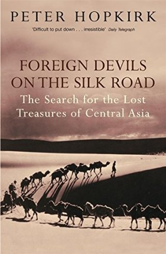

# Foreign Devils on the Silk Road
## Peter Hopkirk

**Sun, 20 Jan 2013**

I'm a huge fan of Peter Hopkirk, he's one of my favorite authors.   Unfortunately I read the vast majority of his books, all but the Quest for Kim, before I began taking notes in them.   I find his style delightful and highly enjoyable, he really know's how to tell tale and I can't recommend his books enough.  If I was a new reader to this area, I'd start with The Great Game.  Below I've selected a few passages that were especially interesting, but really one needs to read everything Peter Hopkirk has written :)
 
***Page 57/58/59/60***
> Fifteen days later there came a grim warning of trouble. Hedin discovered to his horror that they had only enough drinking water left for another two days.  At the last well his men had been told to fill the tanks which the camels were carrying with enough water for ten days, to allow an ample supply until they reached the Khotan-daria.  Hedin cursed himself for not personally supervising this.  The guide swore they would reach the river in two days, but Hedin was far from convinced.  Afterwards, with hindsight, he admitted that he should have turned back. Had he stopped to weigh the risks, he wrote, 'the caravan would have been saved and no life would have been lost'.  Instead, after drastically reducing the party's water ration, with none at all for the camels, he decided to press on.
>
> That night they dug in vain for water, working frenziedly for several hours by candle-light but finding nothing  Next day Hedin decided to abandon two ailing camels and all superfluous baggage.  Rain clouds gathered briefly, greatly raising their hopes, but then dispersed.  A sandstorm next struck the exhausted caravan, forcing them to steer by compass alone.  Another camel had to be left behind to die.  Then Hedin's men discovered that Yolchi, the guide, had been stealing their precious water.  There was now none left.  But for Hedin's intervention the others would have killed him for this treachery. Hedin now made what he feared would be the last entry in his travel diary.  He wrote: "All, men as well as camels, are extremely weak.  God help us!" Five full days had now passed since their discovery that they only had enough water left for two.
>
> On May 1, after being without water for an entire day, in desperation Hedin tried quenching his thirst with the spirit brought for the primus stove.  Soon he found himself unable to move.  His only hope was for the rest of the party to reach the river and then come back for him, so they pressed grimly on without him.  After a while, however, his strength returned and he crawled on, following their trail across the sand and catching them up where they had be forced to halt.  No one now had the strength to move.  That moment, Hedin wrote afterwards, 'was the unhappiest I lived through in all my wanderings in Asia'.>
>
> By now one of his four men was unconscious.  The others killed the rooster they still had with them and rank its blood.  Next came the turn of the sheep, but Hedin found himself unable to swallow its  coagulating blood.  Two of his men tried drinking camel's urine, only to be violently sick.
>
> Tormented by the thought of the grief his disappearance would cause to his family, Hedin made one last resolution to keep going.  Discarding even his small medicine chest, but keeping his pocket Bible, he set off at sunset with two men and the five surviving camels in a desperate attempt to reach the river.  Behind them they left their two dying companions, including Yolchi the water thief.  His last words to Hedin were: 'Water, sir! Only a drop of water!' But there was none.  During the night another camel died.  Then one of Hedin's two companions - Islam Bai, the caravan leader - announced he could go no further. Again there was no choice, and he was elft behind, this time with the remaining camels and equipment. Hedin and Kasim - the last of his men - crawled on at night, digging themselves into the sand during the day. 
>
> On May 4, their fifth day without water, they were amazed to see footprints.  At last, they believed, they must be be near Khotan-daria, and life-giving water.  But almost immediately they realized that these were simply their own tracks.  They had been travelling in a circle.  The next morning, Hedin recalled, ' Kasim looked terrible.  His tongue was white and swollen, his lips blue, his cheeks were hollow, and his eyes had a dying, glassy lustre.' But then, as the sun rose, they saw with incredulity a dark green line on the horizon.
>
> 'The forest!' yelled Hedin. 'The Khotan-daria! Water!' By 5:30 a.m. they had reached the shade of the trees, bu three hours later had still not come upon the river.  Both men collapsed once again from exhaustion and dehydration. By the evening Hedin had recovered a little and was able to crawl on alone through the trees. But when he finally reached the river he found it completely dry.  A terrible desire to sleep came over him, but he knew that the would die if he were to lose consciousness, so he forced himself to crawl for another mile along the river bed.
>
> Suddenly, ahead of him, there was a splash as a water-bird rose.  'The next moment,' Hedin writes in <em>Through Asia</em>, 'I stood on the brink of a little pool filled with fresh, cool water -- beautiful water!'  He thanked God for his miraculous deliverance, then began to drink feverishly, scooping up the water in a tin.  'I drank, drank, drank, time after time... Every blood-vessel and tissue of my body sucked up the life-giving liquid like a sponge.' His pulse, which had dropped to only forty-nine, began to beat normally again.  'My hands, which had been dry, parched, and as hard as wood, swelled out again.  My skin, which had been like parchment, turned moist and elastic....'
>
> His thoughts then flew to the dying Kasim, lying somewhere back by the dry river bed.  Filling his leather boots with water, Hedin staggered back int the moonlight to look for him, occasionally calling out his name.  At dawn he came upon him, lying just as he had left him. Kasim whispered: 'I'm dying.' Hedin held one of the boots filled with water to his lips.  Kasim gulped it down, followed by the contents of the other.  Later, after being helped by passing shepherds, they discovered with joy that Islam Bai too had survived and had also been found by shepherds. He threw himself at Hedin's feet, weeping.  'He had thought we would never meet again,' wrote Hedin.  One of the camels - the one carrying Hedin's diaries, maps, money and two rifles - had also survived. Everything else, including surveying instruments, had been lost. Of the two other men nothing more was ever heard, and eventually their widows were compensated by Hedin.  There was now no choice but for the three survivors to return to Kashgar, which they finally reached on June 21. Hedin had failed to find his lost city. He had, moreover, learned a bitter lesson. But it had in no way lessened his determination to unravel the secrets of Taklamakan. He immediately sent a messenger to the nearest telegraph station on the Russian border to signal for a new set of surveying instruments to be dispatched to him as soon as possible.  

***Page 150***
> Each camel carried up to five hundred pounds' weigh of ice, the expedition's sole source of water once they had crossed the Tarim.  In addition, Stein hired thirty donkeys to ferry more ice in bags to a point two days beyond the last available water.  There it was dumped, carefully stacked to face the sub-arctic winds which howled across the desert from Mongolia. 

***Page 153***
> Eventually, as Stein's rubbish heap was to prove, the barbarians succeeded in severing Lou-lan from all communication with the distant capital.  But it did not die immediately, having long since learned to be independent of outside supplies or orders.  Indeed, although it had lost all touch with home, the the tiny garrison soldiered on for a surprising number of years.  This we know from one revealing piece of evidence recovered by Stein. It is the last of the many dated documents he found at Lou-lan. Written in the year 330, it records a payment made to a barbarian (probably a mercenary) on the authority of the Emperor Chien-hsing.  No one had told the beleaguered garrison commander that not only had this emperor ceased to rule fourteen years before, but that his whole dynasty had been swept away.
>
> There is a curious, latter-day footnote to the story of Lou-lan.  For it is not far from where this little outpost once stood that seventeen centuries later, in the 1960s, China's defense chiefs chose to site their nuclear weapons - pointing towards their new foe beyond the GReat Wall, the Russians.  Chinese historians today are particularly bitter about the documentary removed from Lou-lan by Hedin and Stein because knoweldge of this period of their nations past is meagre. 

***Page 156/157***
> Locked away in the heart of the Gobi desert, four days' camel ride from the nearest town, lies one of the least-known of China's many wonders, the 'Caves of the Thousand Buddhas' at Tun-huang. Here, carved in irregular rows into the cliff face and filled with magnificent wall-paintings and sculptures, are more than four hundred ancient rock temples and chapels.  The greatest and most extensive - it stretches for a mile - of all Central Asia's <em>ming-oi</em>, or rock temple complexes, ti was for centuries renowned throughout the Buddhist world as a centre for prayer and thanksgiving.  The reason for this is its geographical position.  Situated in a small green valley and surrounded by towering sand dunes, it stands some twelve miles south-west of the township of Tun-huang, which, from Han times onwards, served as China's gateway to the West.  Tun-huang, which means 'Blazing Beacon', was thus the last caravan halt in China proper for travelers setting out along the old Silk Road.  Pilgrims, merchants and soldiers about to leave China for the spiritual darkness and physical dangers of the Taklamakan desert prayed at Tun-huang's shrines for deliverance from the goblins and other perils ahead.  In the same way, travellers reaching Tun-huang from the West gave thanks there for their safe passage through the dreaded desert.  Because it was the point where the northern and southern arms of the Silk Road converged, all travelers coming to or from China by the overland route had to pass through Tun-huang.  As a result of this heavy caravan and pilgrim traffic, the oasis itself acquired considerable prosperity over the centuries, for its markets offered the caravanners their last to chance to lay in supplies of food and water before passing out through the celebrated Jade Gate towards the first of the Taklamakan oases.  
>
> The rock temples of Tun-huang, and the origin of their name, are said to date from AD 366 when the monk Lo-tsun had a vision of a thousand Buddhas in a cloud of glory.  He persuaded a rich and pious pilgrim to have one of the smaller caves painted by a local artist and then dedicated as a shrine to his own safe return.  Others followed suit, and for hundred of years more and more temples and chapels were hewn out of the cliff and decorated in the belief that this was would ensure the donor protection during his travels.  At one time there were more than a thousand of these grottoes, of which four hundred and sixty-nine remain today.

***Page 159/160***
> He was accompanied by what he described as 'the craziest crew I ever led to digging -- so torpid and enfeebled by opium were they'.  Stein was lucky to have even them, however, as a rebellion by a fanatical Moslem group some forty years before had severely depleted the local population, resulting in an acute labour shortage.

***Page 190/191/192***
> In the autumn of 1890, around the time when Pelliot was shipping his treasures home from Chinese Central Asia, British intelligence chiefs in Simla began to take an interest in the movements of two young Japanese archaeologists who had turned up on the  Silk Road.  Although unaware of it themselves, the men had been observed from the moment they entered Chinese Turkestan overland from Peking. In true <em>Kim</em> fashion they were shadowed for over a year by a succession of Moslem traders, native servants and others on the payroll of the Indian Government. Regular reports on their movements as they travelled from oasis to oasis, sometimes together, more often hundreds of miles apart, were compiled in Kashgar by Captain A. R. B Shuttleworth, temporarily in charge of the consulate while Macartney was on leave in England.  These were carried across the Karakoram by runner with the official mail to Sir Francis Younghusband, then British Resident in Kashmir, for onward transmission to Simla.
> 
> ...
>
> By 1908, when the second Otani mission arrived on the scene, they were regarded in a very different light.  Moreover, if the British suspected that they were there for some reason other than archaeology (that well-known cover for espionage), then the Russians, still smarting from their defeat at the hands of the Japanese, were even more convinced of it.  Captain Shuttleworth was assured by his Russian opposite number in Kashgar that one of the two Japanese, Zuicho Tachibana, was in fact an officer in the Imperial Japanese Navy, and the other Eizaburo Nomura, an army officer. But besides digging up old ruins, and removing large quantities of antiquities, what were they really up to?  The question was to cause considerable head-scratching in British Indian intelligence circles - and, no doubt, in Russian ones too.
>
>  ...
>
> The task of shadowing the two men for many weeks and over hundreds of miles had been made considerably easier by the network of <em>aksakals</em> (literary 'white-beards') which had been established by Macartney in the main population centres.  They were usually the senior Indian -- and therefore British - trader in ach of the main oases.  Officially they were responsible for the well-being and good behavior of their expatriate community, and with assisting any British traveller who might pass through their territory.  However, as Shuttleworth's secret reports (now in the so-called 'Political and Secret' files in the India Office Library) reveal, they sometimes turned their hands to the Great Game.

***Page 197***
> ... The Finns, rather like the Hungarians, trace their ancestry back to the warlike hordes who once inhabited the Asian steppes, and their scholars were anxious to enlarge their knowledge of the peoples and history of this region.  
>
> As Mannerheim rode, in addition to mapping his route and recording military intelligence, he also measured human heads with calipers, collected everything from rustic surgical instruments to rolling pins, and purchased antiquities and manuscripts. 

***Page 200/201***
> ... that the Russians made their first -- and only -- discovery of major importance.  This was Karakhoto, meaning 'Black City', and not to be confused with Karkhoja. ...
>
> ... At a remote spot in the Gobi he and his men were astonished to see rising from the desert a huge fortress town.  'The walls of the town are covered with sand, in some places so deeply that it is possible to walk up the slope and enter the fortress,' Koslov reported.  The awe struck Russians made their entry, however, through the great western gateway.  'Here we found a quadrangular space whereon were scattered high and low, broad and narrow, ruins of buildings with rubbish of all kinds at their feet,' Koslov added.
>
>Local oasis-dwellers told the Russians how the city came to be destroyed (in the fourteenth century, it is now known, a hundred years or so after Marco Polo's visit).  The last ruler of the city - one Kara-tsian-tsiun - putting his faith in his hitherto invincible army, determined to seize the throne of China for himself.  The Emperor dispatched a considerable force against him and, after a series of battles, finally cornered the rebel in his capital.  Finding that they could not take it by assault, because of its high walls, the Chinese decided to sever its only water supply, the Etsin-gol river. Filling thousands of bags with sand to form a dam, they managed to diver this away from the city. (As confirmation of this story, Koslov came upon evidence of the dam.) The defenders, desperate for water, began to dig a deep well in one corner of the fortress. Finding no water they resolved to face the Chinese in one last desperate battle.  Kara-tsain-tsiunn, anticipating defeat, had his treasury, filling eighty carts, it was said - lowered into the well.  He next killed his two wives and his son and daughter, fearing what might happen to them if they fell into Chinese hands.  Finally, he ordered a breach to be made in the northern wall, and through this he charged at the head of his troops.  His once invincible army was wiped out and he himself killed.  The Chinese reduced the city to ruins, having firs tried to find the treasury which they knew must be somewhere near.  But they failed, as all subsequent attempts had.  This, it was said, was because Kara-tsian-tsiun had cast a spell over the spot before charing to his death.

***Page 209/213/215***
> In the autumn of 1923, two Americans floundered westwards along the old Silk Road...
>
> The two bedraggled travelers, both of them orientalists, were Langdon Warner of the Fogg Art Museum at Harvard and Horace Jayne of the Museum of Pennsylvania.  With their modest four <em>mappas</em>, or two wheeled Chinese carts, and their secretary-interpreter Wang, they comprised the first American expedition to Chinese Central Asia.
>
>... as it turned out he [Warner] and Jayne had come only just in time, for the door was already beginning to close.
>
>...
>
> AS they continued westwards, the two men became aware of something else.  'For days now,' Warner recounts, 'there had been a strange, half-felt presence on the Great North-West Road, as of other foreigners with us... Every chamber of every inn and many bare walls in abandoned towns were scrawled with Russian names and regimental numbers and dates not many months old.' More foreigners had trodden the Silk Road in the previous three years, he added, than in the two thousand years before.  These were the White Russian refugees, civillians and soldiers, fleeing eastwards from the Bolshevik terror.  Many were already living in Peking and Shanghai, while some had gone even further east.  Warner wrote: '... Japanese cities saw, for the first time in history, white men and barefoot women begging from Asiatics by the roadside.' Except for the occasional straggler, almost all the refugees had now left the Silk Road.  They did, however, come upon one lonely, ragged sixteen-year-old Russian boy to whom they gave what money they could spare.  His 'fresh blue eyes' were to haunt Warner for the rest of his life.  He often wondered what became of that boy 'in the cynical school to which I left him - a North China winter and the cant mercy of the yellow man'.

***Page 217/218/219***
> Soon the men were suffering from exhaustion and Jayne decided to ride one of the camels.  It was a near fatal error.  When he dismounted from his kneeling camel at the next halt, he fell flat on his face, unable to stand.  Warner wrote: 'I stretched him on the snow with his back to a blaze and took off his fur boots to find both feet frozen stiff.' For the next three hours he and Wang, their interpreter, rubbed Jayne's feet with snow (the classic emergency treatment for frostbite, which had nonetheless failed to save Stein's toes). When the sensation returned, the pain was so severe that Jayne passed out.  'Still we scrubbed feverishly, hardening our hearts,' Warner recounts.  Occasionally they gave their patient a drink of raw Chinese spirit which they carried as fuel for the small emergency cooker.  Finally they rubbed the frozen skin with grease, in the hope that this would save some at least of the blistered skin. 'We put his soles against the bare skin inside our shirts to give them natural heat,' wrote Warner.  "All this time he had uttered no word of complaint, mustering up a feeble grin when I asked him the banal question of how he felt.'
>
>... Jayne had developed a high fever and Warner was haunted by the fear of his feet turning gangrenous. After an absence of three days, Wang returned in the middle of the night with a ramshackle cart and its reluctant owner.  The next day they set out with Jayne in the cart and the anxious Warner trudging behind, cursing himself for letting the misfortune happen and wondering how one amputated a human foot 'with a hunting knife and no anesthetics'. 
>
>... 
>
>It was a nightmarish journey made even worse by the unexpectedly hostile attitude of the local population who, in one village, greeted the foreigners with jeers and catcalls, and in other tried to extort money from them or even rob them.  It was their first encounter with such behavior, and was not to be their last.  Finally, on the eighteenth day, they reached the walled town of Kanchou. To their relief, the Chinese doctor was there- 'full of Christianity and antiseptics', wrote the grateful Warner.  After cleaning Jayne's blistered and swollen limbs he pronounced that they had already begun to heal and that gangrene was no longer a serious risk. After a further sixteen days spent convalescing Jayne felt sufficiently better to leave for Tun-huan.  
>
>...
>
>Moreover, the worst of the Chinese Central Asian winter was still to come.  Deeply disappointed, Jayne agreed to make his way slowly back to Peking with the meagre material they had excavated at Karakhoto. 

***Page 219/220/222***
> Wang, the little priest, was absent (as ever), but this did not deter Warner.  He made straight for the painted caves, and during the next days rarely left them except to eat or to sleep.  In <em>The Long Old Road in China</em> he recounts: '... there was nothing to do but gasp... for the first time I understood why I had crossed an ocean and two continents, plodding beside my cart these weary months.' Warner, the most visually educated of the archaeologists to visit Tun-huang, found himself stupefied by the tens of thousands of painted figures in the caves.  He confessed: 'I, who had come to attribute dates and glibly to refute the professors and to discover artistic influences, stood in the centre of a chapel with my hands dug deep in my pockets and tried to think.' 
>
>But soon, as he visited cave after cave, another emotion seized him - blind fury.  Two years earlier, four hundred White Russian soldiers who had escaped across the frontier into China had been interned for six months at Tun-huang by the authorities.  Evidence of their frustration and boredom was to be seen everywhere.  Warner wrote angrily to his wife: '... across some of these lovely faces are scribbled the numbers of a Russian regiment, and from the mouth of a Buddha where he sits to deliver the Lotus Law flows some Slav obscenity.' The Russians had done so much damage that the photographs taken by Stein and Nouette were now the sole record of many of the wall-paintings. 'My job', he told his wife, 'is to break my neck to rescue and preserve anything and everything I can from this quick ruin.  It has been stable enough for centuries, bu the end is in sight now.'
>
>Fortuitously, he had arrived armed with a special chemical solution for detaching wall-paintings, which had been successfully pioneered in Italy.  His original intention had been merely to test the solvent and at the same time remove a few small fragments for laboratory analysis.  Even this was something none of his predecessors had dared attempt - inhibited, if not by ethical considerations, then by the policing of the caves by Wang.  However, having seen the destruction wrought by the Cossack soldiers, Warner's scruples vanished.  He wrote: 'As for the morals of such vandalism I would strip the place bare without a flicker.  Who knows when Chinese troops may be quartered here as the Russians were? And, worse still, how long before the Mohameddan rebellion that everyone expects? In 20 years this place won't be worth a visit...' He pointed out that every new pilgrim scratched his name on the paintings or removed a bit of 'trembling plaster'.  
>
>... he still had Abbot Wang to contend with...
>
>... he agreed to part with one old one - a three-foot T'ang figure of a kneeling saint, today one of the most prized items in the Fogg Museum collection.
>
>...
>
>In his letters home Warner asked that no mention be made of the paintings to his sponsors, for he was far from confident that the laboratory would be able to disentangle the gluey cloths from their delicate paint surfaces. (I the event, they rescued eleven of the twelve pictures.)
>
>...
>
>Warner reached Peking safely with his treasures some nine months after he had set out with Jayne the previous autumn.

***Page 223/228***
> But on May 30, 1925, something happened which no one could have foreseen.  A British police officer in the treaty port of Shanghai, faced by rioting Chinese students who refused to disperse, ordered his men to open fire.  Eleven students died - most of them, it as said, shot in the back.   A wave of anger against foreigners swept across China. Warner, who had recently arrived in Peking at the head of a larger expedition, reported: 'News of the Shanghai shooting on that day travelled like wild-fire through the interior.' Missionaries and other foreigners in remote stations had to be evacuated to the coastal cities.  When Warner's party reached Tun-huang, where they had planned to work for eight months, they were met by a menacing mob of peasant farmers - the same people who had welcomed Warner the previous year.
>
>...
>
>The day of the freebooter was over. From now on, if one dug at all one dug for China. There were few, if any, takers.

***Page 229/230***
> For the bigger the museum and the more comprehensive its contents, the smaller the space it can devote to any particular collection.  Had Stein been working for the small but ambitious young Fogg Museum, one can imagine the spectacular display his treasures would enjoy today. As it is, one cannot help feeling that he merely dug them up in China only to seem them buried again in Bloomsbury.  There is a strong case, it could be argued, for a museum returning to the country of origin all antiquities - like these = which it has no prospect of putting on display.
>
>... 
>
>The biggest wall-paintings, some of which stood over ten feet high, were alas, cemented to the walls in iron frames.  At that nobody could have foreseen that this would be the direct cause of their destruction some fifteen years later during World War II.  When hostilities broke out, all the movable objects, including the smaller murals and sculptures, were packed away in crates. Some were deposited for safety in the huge bunker in the Berlin zoo, others at the bottom of coal mines in western Germany, while others still were stored in the museum's basement which had been specially reinforced for the purpose. 
>
>The very largest of the wall-paintings could not, however, be moved to safety.  Not only were they cemented firmly into place, but removing them would have meant first cutting them into pieces once gain.  Instead, the museum placed iron covers and sandbags over them tot shield them from the effects of blast.  'Apart from that,' a senior West Berlin museum official told me, 'there was nothing they could do but pray that no harm would befall them.'  Their prayers were not heeded, however.  The museum, which lay close to today's Berlin Wall, was hit no fewer than seven times by Allied bombs between November 23, 1943, and January 15, 1945.  Twenty-eight of the largest wall-paintings - almost all of them from Bezeklik - were totally destroyed after surviving wars, earthquakes and iconoclasts for well over a millenium. All that remains of them today are the plates in von Le Coq's great portfolio of the paintings form his first expedition - and the gaping holes in the walls of the rock-hewn monastery overlooking the Sangim gorge. 
>
>...
>
>Of all the collections I have seen of Chinese Central Asian art - and that includes almost all of them - the one in West Berlin is by far the largest and most imaginatively displayed.  Even the secondary pieces are well displayed in the basement, where they can be seen by arrangement.
>
>...
>
>When the bunker at the zoo, where some of the treasures were stored, fell into the hands of the Russians in 1945, its secrets were quickly discovered.  It is now known that at least eight or nine packing cases of clay sculptures - only the Russians know the exact number - were removed and driven away on lorries...
